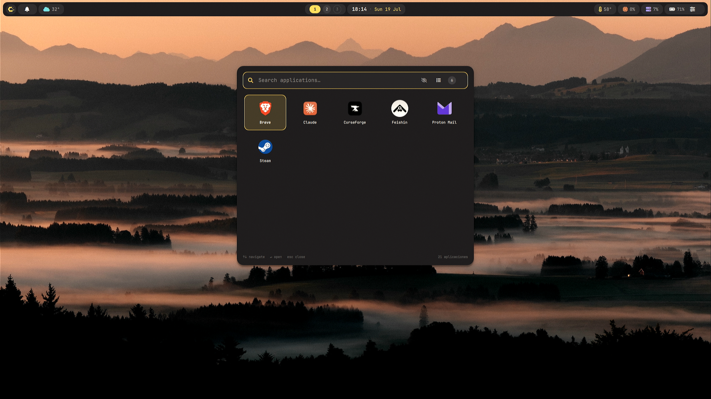
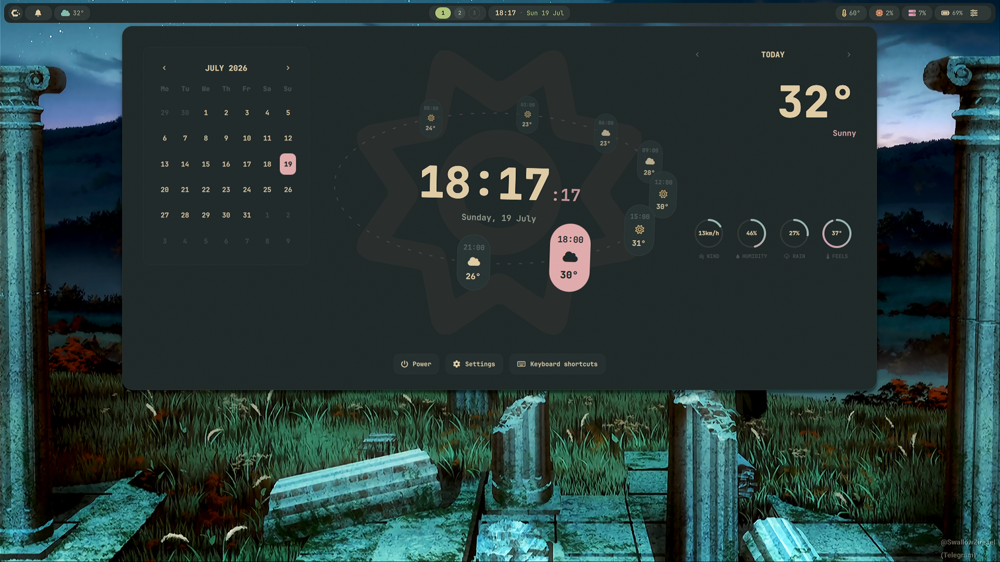
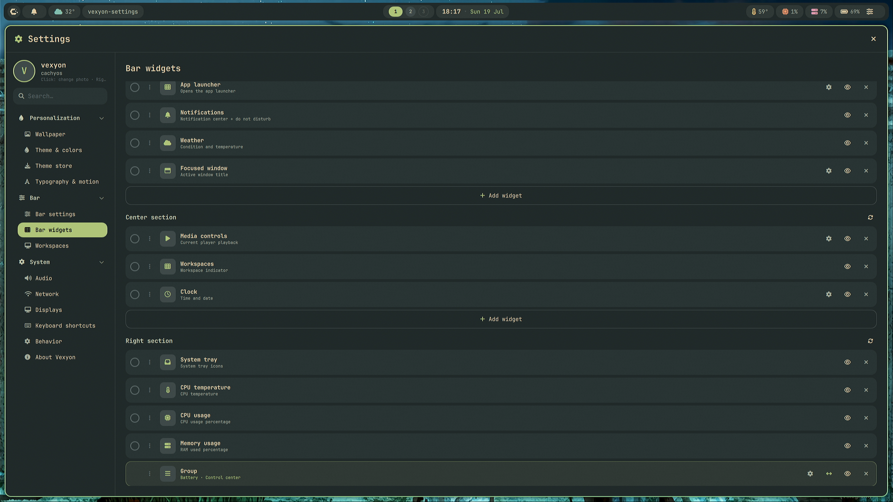
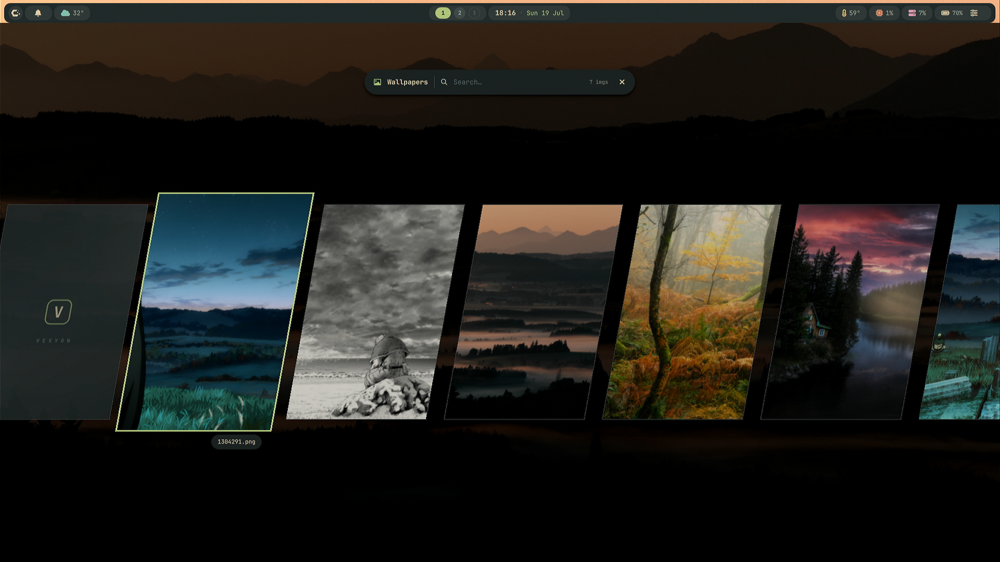
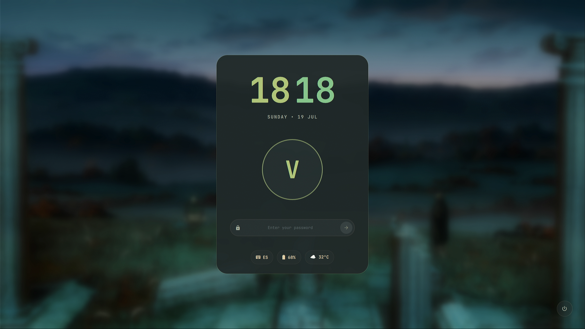

<div align="center">

# Vexyon Shell — NixOS

**A from-scratch Wayland desktop shell for Hyprland — lightweight, fully themeable, and 100% configurable from the UI. No dotfiles required.**

[](https://nixos.org)
[](https://nixos.wiki/wiki/Flakes)
[](https://hypr.land)
[](https://quickshell.org)
[](https://wayland.freedesktop.org)

<br>



</div>

Vexyon is a complete desktop shell built from scratch in QML on [Quickshell](https://quickshell.org): bar, launcher, panels, settings, lock screen, OSD and even the login greeter are one cohesive, themed system — not a collection of separate tools. Everything is configured from the built-in Settings app; you never have to touch a config file.

> **This is the NixOS track.** It ships a flake and a NixOS module instead of the `install.sh` + `pacman` installer used by the Arch/CachyOS version. The shell itself is the same codebase; only the install and system-integration layer differs. See [`NIXOS_PORT_PLAN.md`](NIXOS_PORT_PLAN.md) for the design and what is verified.

---

## ✨ Showcase

<div align="center">
<table>
  <tr>
    <td align="center" width="50%">
      <br>
      <sub><b>Dashboard</b> — clock, calendar and weather with hourly forecast</sub>
    </td>
    <td align="center" width="50%">
      <br>
      <sub><b>Settings</b> — add, remove and reorder bar widgets from the UI</sub>
    </td>
  </tr>
  <tr>
    <td align="center" width="50%">
      <br>
      <sub><b>Wallpaper picker</b> — browse and search your wallpapers</sub>
    </td>
    <td align="center" width="50%">
      <br>
      <sub><b>Lock screen</b> — blurred wallpaper, themed clock and status pills</sub>
    </td>
  </tr>
</table>
</div>

---

## Features

- **100% configurable from the UI** — the Settings app covers wallpaper, themes, typography & motion, bar layout, keybinds, audio, network, displays and behavior. Changes apply live: a small bridge regenerates the Hyprland config and reloads it for you. No dotfile editing, ever.
- **Fully themeable** — 6 bundled themes (Catppuccin Mocha & Latte, Tokyo Night, Gruvbox Dark, AMOLED, Crimson Voltage) plus a theme store. The active theme drives the whole desktop: bar, panels, OSD, lock screen, greeter and even Hyprland window borders recolor instantly on switch.
- **Modular bar** — add, remove and reorder widgets per section: workspaces, clock, weather, media controls, focused window, system tray, CPU/RAM/temperature, battery, notifications and more.
- **Custom greetd greeter** — the login screen is part of the shell and stays in sync with your theme, language and keyboard layout.
- **Multimedia keys + themed OSD** — volume, brightness, mic mute and media keys work out of the box, with a clean bottom-center OSD that follows your theme. Event-driven (MPRIS and PipeWire handled in-process — no `playerctl`/`wpctl` spawning).
- **Dynamic iGPU pinning for hybrid laptops** — on iGPU + NVIDIA machines the session runs pinned to the iGPU; a udev hotplug handler re-decides on display hotplug, so plugging an external monitor wired to the dGPU works without reboot or re-login. No daemons, no polling.
- **Built-in everything** — app launcher, file manager, clipboard history, screenshot tool with region crop, notification center, quick settings, media / volume / network / battery / system-monitor panels, power menu and a keybind editor.
- **Lock screen with PAM auth** — blurred wallpaper backdrop, themed clock, avatar and status pills (keyboard layout, battery, weather).
- **i18n** — English and Spanish, switchable live from Settings (dates, weather and all UI strings included).
- **Lightweight by design** — event-driven services, timers that only run when their widget is on screen, minimal external dependencies.

## Requirements

- **NixOS** with flakes enabled
- A system that can run Hyprland on Wayland

Tested against **NixOS 26.05**, with **Hyprland 0.55.4** and **Quickshell 0.3.0** as packaged in `nixpkgs` 26.05. The flake pins `nixpkgs` to `nixos-26.05` itself, so those are the versions you get unless you override the input.

You do **not** need to enable Hyprland, PipeWire, polkit, portals or fonts yourself — the module turns on everything the shell needs, and pulls in its own runtime dependencies (Quickshell, greetd, ghostty, fish, `awww`, `hyprsunset`, `cliphist`, `grim`, `brightnessctl`, `udisks2`, …).

If flakes are not on yet:

```nix
nix.settings.experimental-features = [ "nix-command" "flakes" ];
```

## Installation

Add the flake as an input and import the module in your system flake. On a default NixOS install that file is **`/etc/nixos/flake.nix`** — the directory that already holds the `configuration.nix` referenced below:

```nix
{
  inputs = {
    nixpkgs.url = "github:NixOS/nixpkgs/nixos-26.05";
    vexyon.url = "github:vexyon/vexyon_shell_nixos";
  };

  outputs = { nixpkgs, vexyon, ... }: {
    # ⚠ REPLACE `myhost` with your own machine's hostname (an identifier — run
    #   `hostname` in a terminal if you are not sure what yours is).
    #   `myhost` appears TWICE: here, and in the `nixos-rebuild switch
    #   --flake .#myhost` command further down. The two MUST match exactly, or
    #   the rebuild will not find this configuration.
    nixosConfigurations.myhost = nixpkgs.lib.nixosSystem {
      system = "x86_64-linux";
      modules = [
        ./configuration.nix
        vexyon.nixosModules.vexyon
        {
          services.vexyon = {
            enable = true;
            # ⚠ REQUIRED — replace `yourname` with your actual Linux username.
            #   `yourname` appears TWICE in this example: here, and in the
            #   `users.users.yourname` line below. Change BOTH, to the same
            #   username.
            user = "yourname";
          };

          # The power menu's polkit rule grants the login1 actions to `wheel`,
          # so the user must be in it or suspend/reboot/shutdown will ask for a
          # password the shell cannot prompt for.
          #
          # ⚠ SECOND occurrence of `yourname` — replace it here too, with the
          #   same username you used above.
          users.users.yourname.extraGroups = [ "wheel" ];
        }
      ];
    };
  };
}
```

Then rebuild and reboot. `--flake .` resolves the flake in the *current* directory, so you have to be standing in the one holding the `flake.nix` you just edited:

```bash
cd /etc/nixos                               # the directory containing your flake.nix
sudo nixos-rebuild switch --flake .#myhost  # ⚠ `myhost` must match nixosConfigurations.myhost above
sudo reboot
```

After the reboot the Vexyon greeter is your login screen — pick the **Vexyon** session and you're in. On first login the shell seeds your personal config into `~/.config/vexyon/shell.json`, `~/.config/hypr/` and `~/.local/share/vexyon/`; from then on those files are yours and the Settings app writes them.

### Module options

That's the whole option surface — everything else is configured at runtime from the Settings app.

| Option | Type | Default | What it does |
|---|---|---|---|
| `services.vexyon.enable` | bool | `false` | Turn the shell on. |
| `services.vexyon.user` | string | *(required)* | The user Vexyon belongs to. The greeter mirrors this user's theme, language and keyboard layout, and owns the mutable greeter state in `/var/lib/vexyon-greeter`. Also added to the `video` and `input` groups. |
| `services.vexyon.greeter.enable` | bool | `true` | greetd + the Vexyon greeter as the login screen. Set to `false` to leave login to whatever else you have enabled (the equivalent of the Arch installer's `VEXYON_GREETER=0`). |
| `services.vexyon.gpu.pin` | bool | `true` | Install the udev rules that pin the session to the integrated GPU on hybrid machines and react to display hotplug. Harmless on single-GPU systems — nothing is elected and no symlink is created. |
| `services.vexyon.package` | package | the flake's `vexyon-shell` | Escape hatch to substitute your own build. |

### Building without the module

To just build the package (for hacking on it, or to inspect the closure):

```bash
nix build github:vexyon/vexyon_shell#vexyon-shell
```

Or from a local checkout:

```bash
nix build .#vexyon-shell     # result/ symlink
nix flake check              # evaluate + build the package
nix develop                  # dev shell with quickshell, hyprland, jq, python3
```

> The package has no single entry-point binary, so there is no `nix run` target — it ships the QML tree plus a set of helpers (`vexyon-start`, `vexyon-bridge`, `vexyon-seed`, `vexyon-gpu-detect`, …). Use the module to actually run the shell.

### Notes specific to NixOS

- **Your login shell is not changed.** The module enables `programs.fish` because the shell themes it, but it does not set your shell. If you want fish as your login shell: `users.users.yourname.shell = pkgs.fish;`
- **Code lives in the Nix store, state lives in your home.** Unlike the Arch version — where `~/.config/vexyon` holds both the QML and your settings — here only mutable state is in `$HOME`. The QML, helpers and bridge come from the store, so a `nixos-rebuild` updates the shell without touching your config.
- **Greeter state is in `/var/lib/vexyon-greeter`**, not `/etc`. It has to be writable: the bridge rewrites the greeter's theme snapshot on every theme change, and the GPU hotplug handler rewrites the pin there. It is owned by `services.vexyon.user` so none of that needs privilege escalation.
- **`install.sh` is for the Arch/CachyOS track** and is not used here. It is kept in the tree because both tracks share one codebase.

---

<div align="center">

## Support & Socials

Follow the project, or help keep development going — every bit of support is genuinely appreciated 💚

<br>

[](https://www.tiktok.com/@vexyon.dev?is_from_webapp=1&sender_device=pc)
[](https://www.instagram.com/vexyon.dev/)
[](https://ko-fi.com/vexyon)

<sub>If Vexyon makes your desktop nicer, a coffee on Ko-fi is an optional but lovely way to support its development ☕</sub>

</div>
